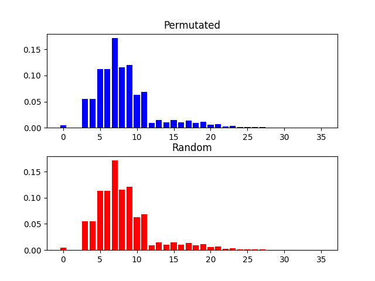

# Parchis distance calculator

Calculate the chances of a Parchis piece to reach a given square in a single turn

The rules are the following:
- You roll 2 dice (usually 6-sided)
- If you roll a double, you get an extra turn
- If you roll 3 doubles in a row, your piece goes back to the start

My calc is only correct if you have 1 moveable piece (in real Parchis you can make each move with a different piece and therefore "discard" one of the rolls)

